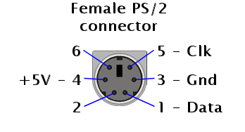

# PS/2 TO AMSTRAD XT KEYBOARD PROTOCOL CONVERTER

This is an Arduino board based project to convert PS2 keyboard protocol to Amstrad XT protocol. 

Amstrad had its own keyboard protocol different from the IBM PC XT one.   This protocol appears to be the same as the one used by later Amstrad XT keyboards up to the PC3086, so in theory this converter should be compatible with Amstrad PC1512 / PC1640 / PC2086 / PC3086.

**Please note that actually It has only been tested with Amstrad PC1512.**

Code is based and adapted from PS/2 to XT keyboard converter  <https://github.com/kesrut/pcxtkbd>

Please add https://github.com/techpaul/PS2KeyAdvanced Arduino library to compile.

I used an Arduino nano (5V) board. Any other Arduino based board can be used as far as it has 5 V logic levels as keyboard power supply and signals work at 5 V.

### Schematic and pinouts

A Female PS2 connector (Mini-DIN-6) is needed to connect to the male connector of PS2 keyboard.

A Male DIN 6 connector is needed to connect to the female connector of the Amstrad motherboard.

Follows pinout of the DIN-6 female connector of the Amstrad motherboard:

Pins M1 and M2 are not used for keyboard.

More information and the schematic from where I based my project, can be found at http://www.ccgcpu.com/2019/02/14/the-xt-part-4-adapting-a-modernish-keyboard/, where describes a PS2 to XT protocol converter.   **Please be careful** asIMHO the schematics shown in this article are a bit confusing, as I end up connecting power in the wrong way, so as a result one Arduino nano was fried and  the PS2 keyboard is broken.

I first built a PS2 Mini-Din-6 female to DIN-5 male IBM XT protocol converter. As I fried my second Nano board, I decided to use the same converter and make it compatible also with the Amstrad using another adapter to connect the wires. As I did not have the 6-way Din Amstrad PC1512 keyboard connector I ended up soldering the keyboard wires directly to the motherboard. **I apologize if some of you got a heart attack after seeing this.**

### Bill of materials

* Arduino Nano 5V
* DIN5 Male to Mini DIN6 PS/2 Female keyboard adapter cable (From where I get the mini-DIN-6 female, and also the DIN5 to build the converter to IBM XT protocol )
* DIN6 Male connector 
* Wires and thermo-retractil shrinking tubing 

### Protocol adaptation

In order to adapt the protocol I found the following documentation regarding the PC1512 protocol:

* Amstrad PC1512 protocol <https://www.seasip.info/AmstradXT/pc1512kbd.html>
* Keyboard signals timing graph <http://www.kbdbabel.org/signaling/index.html>

These are the signals graphs when the key "k" is pressed: 

When I had the XT protocol converter running well, I adapted the Arduino code to look like the PC1512 graph with the help of a logic analyzer.

**Final assembly of the adapter (pictured attached to the logic analyzer):**

